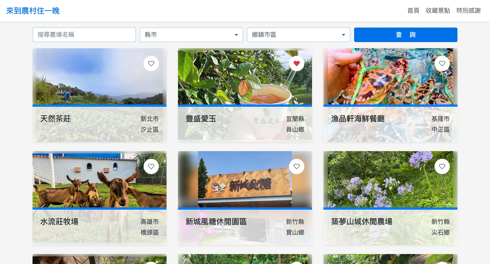

<a name="readme-top"></a>

<div align="center">
  <h1>來到農村住一晚</h1>
  <p>
    使用「行政院農業委員會 - 來到農村住一晚-休閒農場住宿資訊」資料，提供搜尋景點、收藏景點、規劃路線功能
  </p>
  <p>
    <a href="https://yuna9068.github.io/farm-stay/">Github Live Site URL</a>
  </p>
</div>


## Table of contents

* [Features](#features)
* [Screenshot](#screenshot)
* [Built with](#built-with)
* [Getting Started](#getting-started)
    * [Prerequisites](#prerequisites)
    * [Installation](#installation)
* [Acknowledgments](#acknowledgments)
* [Author](#author)


## Features

* 搜尋景點方式：
  1. 關鍵字搜尋景點名稱
  2. 縣市選單
  3. 鄉鎮市區選單（裝置寬度 576px 以上才可使用）
* 收藏景點：收藏喜愛的景點，並將資料儲存至 localStorage，下次再進入網站仍能看到上次收藏的景點
* 規劃路線：最多加入五個目的地，可拖曳改變順序，點擊按鈕連至 Google Maps 規劃路線
* RWD 響應式網站（使用 Bootstrap）
* 使用 Google Maps Embed API

<p align="right"><a href="#readme-top">⬆︎ BACK TO TOP</a></p>


## Screenshot

<table>
  <tr valign="top">
    <td>
      <p>首頁</p>
      
    </td>
    <td>
      <p>詳細資訊頁</p>
      
    </td>
    <td>
      <p>收藏景點頁</p>
      
    </td>
  </tr>
  <tr valign="top">
    <td>
      <p>首頁 RWD</p>
      
    </td>
    <td>
      <p>詳細資訊頁 RWD</p>
      
    </td>
    <td>
      <p>收藏景點頁 RWD</p>
      
    </td>
  </tr>
</table>

<p align="right"><a href="#readme-top">⬆︎ BACK TO TOP</a></p>


## Built with

* [Vue.js 2](https://v2.vuejs.org/ "Vue.js 2")：前端框架
* [Vue Router 3](https://v3.router.vuejs.org/ "Vue Router 3")：路由管理
* [Vue Cli 4](https://cli.vuejs.org/ "Vue Cli 4")：Vue.js 開發的標準工具
* [Vuex 3](https://v3.vuex.vuejs.org/ "Vuex 3")：Vue.js 的狀態管理模式
* [Bootstrap 4](https://getbootstrap.com/docs/4.6/getting-started/introduction/ "Bootstrap 4")：RWD 響應式網站
* [jQuery 3](https://jquery.com/ "jQuery 3")：Bootstrap 相依套件
* [Popper.js](https://popper.js.org/ "Popper.js")：Bootstrap 相依套件
* [SCSS](https://sass-lang.com/ "SCSS")：設計網站樣式

<p align="right"><a href="#readme-top">⬆︎ BACK TO TOP</a></p>


## Getting Started

若要在本機啟動專案，請依照以下步驟執行

### Prerequisites
* [Node.js](https://nodejs.org) v8.9 或更高版本，需小於 v18（推薦 v16.20.2）
* [Vue CLI](https://cli.vuejs.org/guide/installation.html) v4.5.0

### Installation
1. Clone the repo
    ```sh
    git clone https://github.com/yuna9068/farm-stay.git
    ```
2. Install NPM packages
    ```sh
    npm install
    ```
3. Compile and Hot-Reload for Development
    ```sh
    npm run serve
    ```

<p align="right"><a href="#readme-top">⬆︎ BACK TO TOP</a></p>


## Acknowledgments

* 資料來源：政府資料開放平臺（提供機關：行政院農業委員會）- [來到農村住一晚-休閒農場住宿資訊](https://data.gov.tw/dataset/6413 "來到農村住一晚-休閒農場住宿資訊")
* 版面設計參考：Ildiko 的 UI Design Daily 網站 - [首頁卡片樣式](https://www.uidesigndaily.com/posts/sketch-stock-photos-page-website-mockup-list-image-day-1132 "Stock Photos Page")、[農場詳細資訊頁排版](https://www.uidesigndaily.com/posts/sketch-website-section-day-1228 "Website Section")、[手機首頁排版](https://www.uidesigndaily.com/posts/xd-gallery-mobile-day-284 "Gallery")
* Icon：Font Awesome - [Font Awesome 5](https://fontawesome.com/ "Font Awesome 5")
* 版面設計建議 - [Terry Chen](https://github.com/terry90918 "Terry Chen")
* 網站中使用到的圖片 - [聖安 楊](https://unsplash.com/photos/qFbCt0DpfnY "Photo by 聖安 楊 on Unsplash")、[Yeo Khee](https://unsplash.com/photos/vcwI8Rnj2Mw "Photo by Yeo Khee on Unsplash")、[Yun-Yue Hsu](https://unsplash.com/photos/039jK2RA-gg "Photo by Yun-Yue Hsu on Unsplash")、[Moralis Tsai](https://unsplash.com/photos/T4RhoFLmVV0 "Photo by Moralis Tsai on Unsplash")、[Yeo Khee](https://unsplash.com/photos/aCnoiBVW99s "Photo by Yeo Khee on Unsplash")、[chasing lin](https://unsplash.com/photos/0JoFp8P8w_A "Photo by chasing lin on Unsplash")、[Peggy und Marco Lachmann-Anke](https://pixabay.com/zh/illustrations/magnifying-glass-search-to-find-1019870/ "Photo by Peggy und Marco Lachmann-Anke on Pixabay")

<p align="right"><a href="#readme-top">⬆︎ BACK TO TOP</a></p>


## Author

- GitHub - [Yuna](https://github.com/yuna9068)

<p align="right"><a href="#readme-top">⬆︎ BACK TO TOP</a></p>
